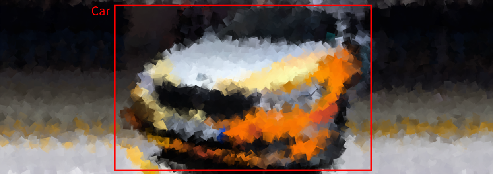

# YOLO v3 CPU Inference API for Linux
This is a repository for an object detection inference API using the YOLO v3 object detection framework incl. OpenCV.
The inference REST API works on CPU and does not require to use a GPU.



Several object detection models can be loaded and used at the same time.
Models trained using the [YOLO v3 training repository](https://github.com/BMW-InnovationLab/BMW-YOLOv3-Training-Automation) can be deployed using this API.

## Install prerequisites
#### Ubuntu
Use the following command to install docker on Ubuntu:
```sh
chmod +x install_prerequisites.sh && source install_prerequisites.sh
```
This API requires Docker to be installed. The software is deployed inside a Docker container.
Hence, there are not any other prerequisites.

## Build the Docker image
In order to build the project run the following command from the project's root directory:
```sh
sudo docker build -t yolov3_inference_api_cpu -f ./docker/dockerfile .
```

## Run the Docker container
#### Ubuntu
To run the API, go to the project's root directory and run the following:
```sh
sudo docker run -itv $(pwd)/models:/models -p <docker_host_port>:7770 yolov3_inference_api_cpu
```
The <docker_host_port> can be any unique port of your choice (e. g. _7770_).
The API file will be run automatically, and the service will listen to requests on the chosen port.

## API endpoints documentation
To see all available endpoints, open your favorite browser and navigate to:
```
    http://<host_IP>:<docker_host_port>/docs
```

## Model structure
The folder "models" contains subfolders of all the models to be loaded.
Inside each subfolder there should be a:
- _.cfg_ file, contains the configuration of the model
- _.weights_ file
- _.names_ file, contains the names of the classes
- _config.json_

The latter is structured as follows (example):
```json
{
    "inference_engine_name": "yolov3_opencv_cpu_detection",
    "confidence": 60,
    "nms_threshold": 0.6,
    "image": {
        "width": 416,
        "height": 416,
        "scale": 0.00392,
        "swapRB": true,
        "crop": false,
        "mean": {
            "R": 0,
            "G": 0,
            "B": 0
        }
    },
    "framework": "yolo",
    "type": "detection",
    "network": "network_name"
}
```
##### Conditions
  - `confidence` value between 0 and 100 (only bounding boxes with confidence higher than the desired value are considered)
  - `nms_threshold` value between 0 and 1

## Example
To use YOLO v3 (Tiny), download the following files:
  - https://github.com/pjreddie/darknet/blob/master/cfg/yolov3-tiny.cfg
  - https://pjreddie.com/media/files/yolov3-tiny.weights
  - https://raw.githubusercontent.com/pjreddie/darknet/master/data/coco.names

Create the following path structure (renaming files might be necessary):
```
    .
    ├── config.json
    ├── obj.names
    ├── yolo-obj.cfg
    └── yolo-obj.weights
```